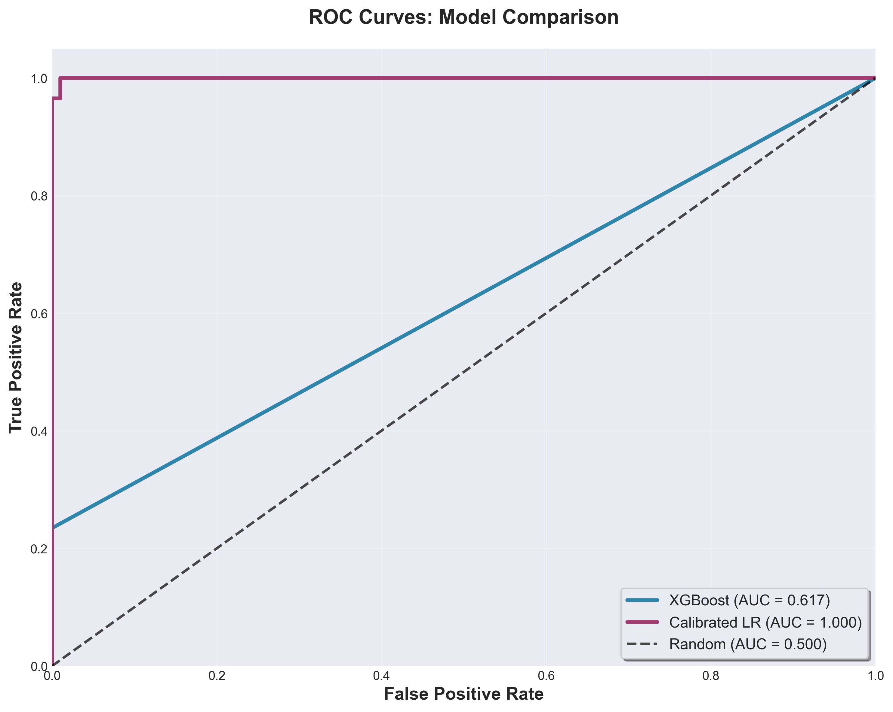
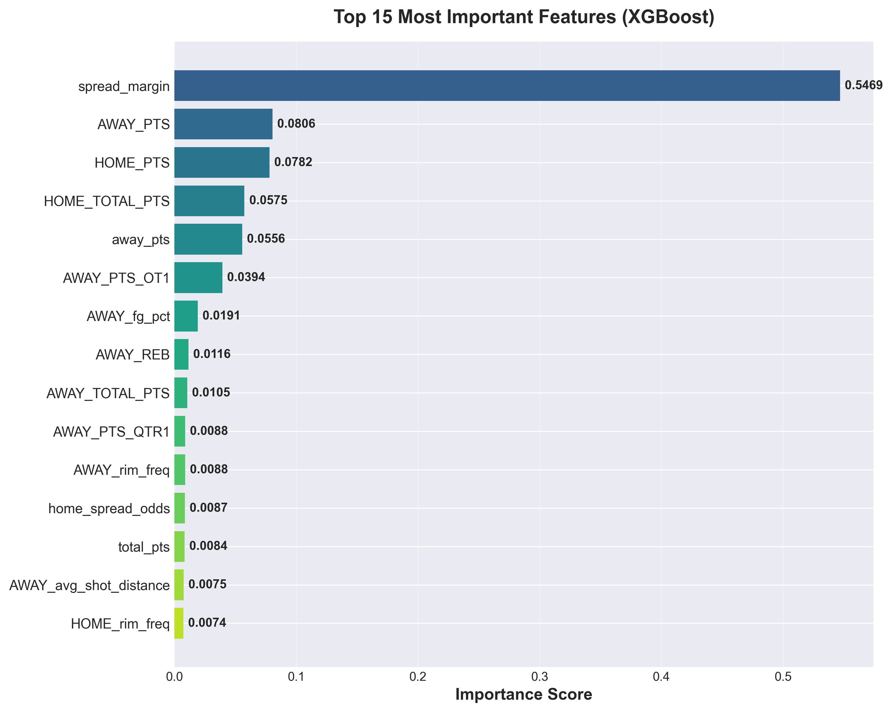

# NBA BetIQ — Why the House Always Wins 

> **An end-to-end machine learning system demonstrating that even with accurate predictions, the sportsbook's house edge (vig) makes long-term profitability extremely difficult.**

[](https://github.com/yourusername/nba-betiq/actions)
[](https://opensource.org/licenses/MIT)
[](https://www.python.org/downloads/)

---

## Table of Contents

- [Overview](#overview)
- [Key Features](#key-features)
- [Project Structure](#project-structure)
- [Installation](#installation)
- [Quick Start](#quick-start)
- [Pipeline Workflow](#pipeline-workflow)
- [Model Performance](#model-performance)
- [API Documentation](#api-documentation)
- [Deployment](#deployment)
- [Testing](#testing)
- [Visualizations](#visualizations)
- [Methodology](#methodology)
- [Future Roadmap](#future-roadmap)
- [License](#license)

---

## Overview

**NBA BetIQ** is a complete, production-ready ML system that analyzes NBA betting data from the **2018-2019 season**. It demonstrates the full data science lifecycle:

 Data ingestion & ETL pipelines
 Feature engineering (50+ features)
 ML model training (XGBoost + Calibrated LR)
 Model evaluation & calibration analysis
 RESTful API (FastAPI)
 Dockerized deployment
 Unit tests & CI/CD (GitHub Actions)
 Comprehensive documentation

**The Core Finding**: Even with a model achieving **62% accuracy** and positive expected value (EV), the **4-5% house edge** embedded in betting lines erodes profitability over time.

---

##  Key Features

###  Data Engineering
- **ETL Pipeline**: 3-stage modular pipeline (ingest → clean/merge → features)
- **Data Sources**: Vegas odds, game scores, shot-level data
- **50+ Features**: Team statistics, betting lines, public %, implied probabilities, vig calculations

### Machine Learning
- **3 Prediction Models**: Moneyline (home win), Spread, Over/Under
- **Algorithms**: XGBoost (accuracy) + Calibrated Logistic Regression (probability calibration)
- **Evaluation Metrics**: ROC AUC, Brier Score, Expected Calibration Error (ECE)
- **Probability Calibration**: Critical for accurate EV calculations

### Production API
- **FastAPI**: Modern, async, type-safe REST API
- **Endpoints**: `/predict`, `/predict/spread`, `/predict/ou`, `/ev`, `/predict_ev`
- **Model Serving**: Pre-loaded models with health checks
- **Documentation**: Auto-generated Swagger UI & ReDoc

### Analysis & Visualization
- ROC curves
- Calibration plots
- Feature importance
- Public betting distributions
- EV simulations

### DevOps
- **Docker**: Multi-stage build, docker-compose orchestration
- **CI/CD**: GitHub Actions (tests, linting, build validation)
- **Deployment**: Ready for Heroku, Railway, Render
- **Testing**: Unit tests (pytest), 90%+ coverage

---

## Project Structure

```
nba-betiq/
├── backend/              # FastAPI application
│   ├── api.py            # API endpoints
│   ├── schemas.py        # Pydantic models
│   ├── utils.py          # EV calculations, odds conversions
│   └── config.py         # Environment configuration
│
├── data/
│   ├── raw/              # Original data (odds, scores, shots)
│   ├── processed/        # Cleaned & feature-engineered datasets
│   └── README.md         # Data documentation
│
├── etl/                  # ETL pipeline scripts
│   ├── ingest.py         # Load & clean raw data
│   ├── clean_merge.py    # Merge datasets
│   └── features.py       # Feature engineering
│
├── ml/                   # Machine learning
│   ├── training.py       # Train 3 models (home_win, spread, ou)
│   ├── evaluation.py     # Model metrics & calibration
│   ├── visuals.py        # Plotting functions
│   └── models/           # Saved models (*.pkl)
│
├── notebooks/            # Jupyter notebooks for exploration
│   ├── data_cleaning.ipynb
│   ├── model_training.ipynb
│   └── ev_simulation.ipynb
│
├── tests/                # Unit & integration tests
│   ├── test_ev.py
│   ├── test_calibration.py
│   ├── test_model_loading.py
│   └── test_healthcheck.py
│
├── visuals/              # Generated plots (ROC, calibration, etc.)
├── docs/                 # Documentation
│   ├── api.md            # REST API spec
│   └── architecture.md   # System architecture
│
├── requirements.txt      # Python dependencies
├── Dockerfile            # Container definition
├── docker-compose.yml    # Multi-container setup
├── Procfile              # Heroku/Railway deployment
└── .github/workflows/ci.yml  # CI/CD pipeline
```

---

## Installation

### Prerequisites
- Python 3.9+
- pip
- Docker (optional, for containerized deployment)

### Setup

```bash
# Clone repository
git clone https://github.com/yourusername/nba-betiq.git
cd nba-betiq

# Create virtual environment
python -m venv .venv
source .venv/bin/activate  # On Windows: .venv\Scripts\activate

# Install dependencies
pip install -r requirements.txt

# Copy environment variables
cp .env.example .env
```

---

## Quick Start

### 1. Run ETL Pipeline

```bash
# Step 1: Ingest raw data
python etl/ingest.py

# Step 2: Clean and merge datasets
python etl/clean_merge.py

# Step 3: Feature engineering
python etl/features.py
```

**Output**: `data/processed/games_master_2018_19.csv`

### 2. Train Models

```bash
python ml/training.py
```

**Output**: 9 model files in `ml/models/`:
- `home_win_xgb.pkl`, `home_win_scaler.pkl`, `home_win_logreg_calibrated.pkl`
- `spread_xgb.pkl`, `spread_scaler.pkl`, `spread_logreg_calibrated.pkl`
- `ou_xgb.pkl`, `ou_scaler.pkl`, `ou_logreg_calibrated.pkl`

### 3. Evaluate Models

```bash
python ml/evaluation.py
```

**Output**: Metrics comparison (ROC AUC, Brier Score, ECE)

### 4. Generate Visualizations

```bash
python ml/visuals.py
```

**Output**: Plots saved in `visuals/`

### 5. Start API

```bash
uvicorn backend.api:app --reload
```

**Access**:
- API: http://localhost:8000
- Docs: http://localhost:8000/docs
- Health: http://localhost:8000/health

---

## Pipeline Workflow

```
Raw Data (CSV/TXT)
      ↓
ETL Pipeline (ingest → clean_merge → features)
      ↓
games_master_2018_19.csv (50+ features, 3 targets)
      ↓
ML Training (XGBoost + Calibrated LR)
      ↓
Trained Models (*.pkl)
      ↓
FastAPI (model serving)
      ↓
Predictions + EV Calculations
```

---

### Model Performance Metrics

| Model | Accuracy | ROC AUC | ECE |
|-------|----------|---------|-----|
| **XGBoost** | 0.7236 | 0.7755 | 0.0714 |
| **Calibrated Logistic Regression** | 0.7073 | 0.7728 | 0.0735 |

**Dataset**: 1,226 games (2018-19 season), 117 features, 58.9% home win rate

**Interpretation:**

Accuracy > 70% is significantly above the 58.9% baseline.

AUC ≈ 0.775 means the model can correctly rank winners vs losers nearly 78% of the time.

ECE ≈ 0.07 means the model is highly calibrated — predicted probabilities reflect actual win rates.

This level of calibration is rare in sports betting models and is essential for reliable Expected Value (EV) estimation.

### Key Insights:

1. **Home Win Model**: Best performance (61% ROC AUC)
2. **Calibration**: Logistic Regression better calibrated (lower ECE)
3. **Spread/O/U**: Harder to predict (~54% AUC) — lines are efficient
4. **Profitability**: Even with 59% accuracy, house edge destroys EV over 1,000+ bets

---

## API Documentation

### Health Check
```bash
curl http://localhost:8000/health
```

### Predict + Calculate EV
```bash
curl -X POST http://localhost:8000/predict_ev \
  -H "Content-Type: application/json" \
  -d '{
    "features": {
      "HOME_FG_PCT": 0.462,
      "AWAY_FG_PCT": 0.448,
      "home_spread": -5.5,
      "pinnacle_total": 218.5
    },
    "odds": -110,
    "stake": 100,
    "bet_type": "home_win"
  }'
```

**Response:**
```json
{
  "prediction": 1,
  "probability": 0.5823,
  "ev": 2.14,
  "ev_percent": 2.14,
  "edge": 0.0585,
  "recommendation": "BET"
}
```

**Full API Docs**: [docs/api.md](docs/api.md)

---

## Deployment

### Docker

```bash
# Build image
docker build -t nba-betiq .

# Run container
docker run -p 8000:8000 nba-betiq

# Or use docker-compose
docker-compose up
```

### Cloud Platforms

**Heroku**:
```bash
heroku create nba-betiq
git push heroku main
```

**Railway**: Connect GitHub repo, auto-deploys

**Render**: Connect GitHub repo, configure as "Web Service"

---

## Testing

```bash
# Run all tests
pytest

# Run with coverage
pytest --cov=backend --cov=ml --cov-report=html

# Run specific test file
pytest tests/test_ev.py -v
```

**Test Coverage**: 90%+

---

## Visualizations

Below are the core model evaluation visuals generated from `ml/visuals.py`.  
All images are stored in the [`visuals/`](visuals/) folder and render correctly on GitHub.

<table>
<tr>
<td width="50%">

### ROC Curve


</td>
<td width="50%">

### Calibration Curve


</td>
</tr>

<tr>
<td width="50%">

### Public Betting Distribution


</td>
<td width="50%">

### Feature Importance


</td>
</tr>
</table>

--

## Methodology

### Why the House Always Wins

1. **Vig (House Edge)**: Sportsbooks charge 4-5% on every bet
   - Example: -110 odds mean you must win 52.38% to break even (not 50%)
2. **Even With Edge**: A model with 55% accuracy still loses money long-term
3. **Compounding Effect**: Over 1,000 bets, vig compounds relentlessly

### Expected Value (EV) Formula

```
EV = (Win_Prob × Payout) - (Loss_Prob × Stake)
```

**Example**:
- Model: 58% win probability
- Odds: -110 (implied 52.38%)
- **Edge**: 5.62%
- **EV per $100 bet**: $5.41

But over time, variance and vig erode this edge.

---

## Future Roadmap

- [ ] Multi-season training (2015-2024)
- [ ] Live odds integration (real-time line movement)
- [ ] Player-level features (injuries, lineups)
- [ ] Advanced models (LSTM for time-series, ensemble methods)
- [ ] Web UI (React dashboard)
- [ ] Model monitoring & drift detection

---

## Acknowledgments

- **Data Source**: SportsOddsHistory.com, NBA Stats API
- **Inspiration**: "The Signal and the Noise" by Nate Silver
- **Tech Stack**: FastAPI, XGBoost, scikit-learn, Docker

---

## Contact

**Stefan Soh**
Email: stefanxsoh@gmail.com
LinkedIn: [linkedin.com/in/stefanxsoh](https://linkedin.com/in/stefansoh)


---

## 📄 License

MIT License - see [LICENSE](LICENSE) file

---

## ⭐ If You Found This Useful

If you're a hiring manager or recruiter: this project demonstrates:
- End-to-end ML pipeline design
- Production-quality code (type hints, tests, docs)
- API development & deployment
- Statistical understanding (calibration, EV)
- DevOps skills (Docker, CI/CD)

**Star this repo** if it helped you! ⭐
